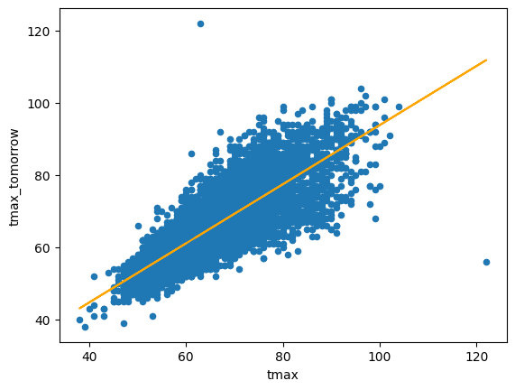
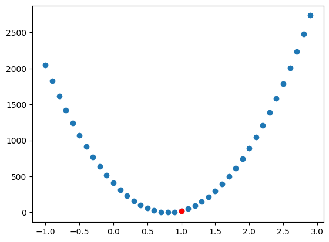
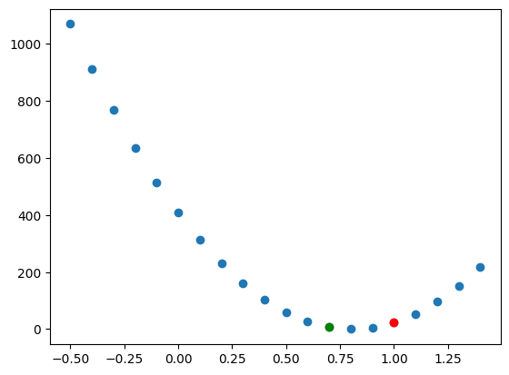

# 🌡️ Weather Temperature Prediction Model

This project is a simple weather temperature prediction model built using Python. The model utilizes linear regression techniques to predict the maximum temperature for tomorrow based on weather features such as current maximum temperature, minimum temperature, and rainfall.

---

## 🧠 Features

- Linear regression from scratch (no high-level ML libraries)
- Visualizations of relationships between predictors and target
- Gradient descent with manual weight and bias updates
- Training loop that minimizes Mean Squared Error (MSE)
- Parameter tuning using gradients and learning rate
- Support for multiple predictors

---

## 🗂️ Project Structure

- data - contains the dataset
- gradient_descent - contains the gradient_decsent.ipynb

---

## 🔧 Technologies Used

- `pandas` – for data handling
- `numpy` – for numeric computations
- `matplotlib` – for data visualization
- `scikit-learn` – for dataset splitting and metrics (optional)
- `math` – for additional math operations

---

## 🚀 How to Run

- Clone the repo
- Install dependencies using the following command:

  pip install -r requirements.txt

- Run Notebook

## 📈 Example Visuals

## 📄 License

This project is open-source and free to use for learning and experimentation purposes.
